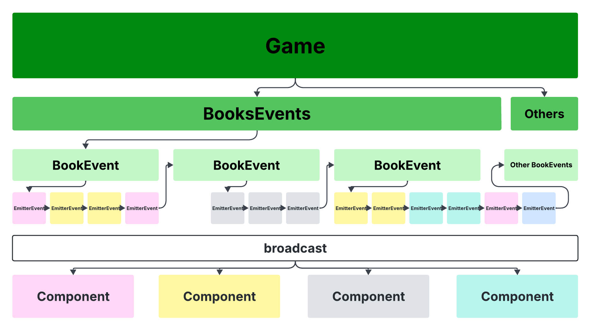

# Task Breakdown

<mark>There is one single idea that is been applied across the whole carrot-game-sdk that is **Task Breakdown**.</mark>

To extend a bit more of the topic above, if an emitterEventHandler does too much work, then it is better we consider to split it into smaller emitterEventHandlers as a process of task-breakdown.

For example, "tumbleBoard" bookEvent is a fairly complicated bookEvent. Instead of having one "tumbleBoard" emitterEvent, we split it into "tumbleBoardInit", "tumbleBoardExplode", "tumbleBoardRemoveExploded", "tumbleBoardSlideDown".

This way we can implement a big and complicated emitterEvent step by step. More importantly, we can test the implementations one by one in storybook of `COMPONENTS/<Game>/emitterEvent`.

```
// bookEventHandlerMap.ts - Example of task-breakdown

{
  ...,
  tumbleBoard: async (bookEvent: BookEventOfType<'tumbleBoard'>) => {
    eventEmitter.broadcast({ type: 'tumbleBoardShow' });
    eventEmitter.broadcast({ type: 'tumbleBoardInit', addingBoard: bookEvent.newSymbols });
    await eventEmitter.broadcastAsync({
      type: 'tumbleBoardExplode',
      explodingPositions: bookEvent.explodingSymbols,
    });
    eventEmitter.broadcast({ type: 'tumbleBoardRemoveExploded' });
    await eventEmitter.broadcastAsync({ type: 'tumbleBoardSlideDown' });
    eventEmitter.broadcast({
      type: 'boardSettle',
      board: stateGameDerived
        .tumbleBoardCombined()
        .map((tumbleReel) => tumbleReel.map((tumbleSymbol) => tumbleSymbol.rawSymbol)),
    });
    eventEmitter.broadcast({ type: 'tumbleBoardReset' });
    eventEmitter.broadcast({ type: 'tumbleBoardHide' });
  },
  ...,
}
```

```
// TumbleBoard.svelte - Example of task-breakdown

context.eventEmitter.subscribeOnMount({
  tumbleBoardShow: () => {},
  tumbleBoardHide: () => {},
  tumbleBoardInit: () => {},
  tumbleBoardReset: () => {},
  tumbleBoardExplode: () => {},
  tumbleBoardRemoveExploded: () => {},
  tumbleBoardSlideDown: () => {},
});
```

Stateless games can be complicated as well (vs. stateful games). For example, a slots game can have different types of spins, number of spins, win rules, number of bookEvents, game modes, global multiplier, multiplier symbols and so on.

- Stateless games: A single request to the RGS will finish the job of playing a game. For example, it requires only one request to play and finish a slots game.
- Stateful games: It requires multiple requests to the RGS to be able to finish the job. For example, a [mines](https://stake.com/casino/games/mines) game.

<a name="taskBreakdownImg"></a>

However with the data structure of math and the functions we have, we are able to break down a complicated game into small and atomic tasks (emitterEvents). It enables us to test the atomics independently as well. Visually it is something like this:



<mark>The colors of the emitterEvents under a bookEvent can be different, which means they are from different svelte components.</mark>